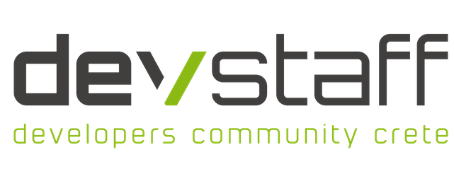

# 

## A Developer Community in Crete

There's a lot of us, devs, here in Crete. Yet, we hardly ever get together in
large groups, or even know each other – somewhat strange for our small
community, we hope you'll agree. This group is an attempt at bringing us all
together for informal chats about what we're all passionate about: technology
and software. Join the meetup, learn, teach, speak your mind, sharpen your
skills, share the knowledge and help us build a community where devs can openly
exchange ideas!

* **Don't know where to start?** Are you new to git and MeetUp? Here is a short intro about the tools we use: [Start Here!](StartHere.md)

* **You just want to join the group?** Great!
  Join our [MeetUp group](https://www.meetup.com/DevStaff-A-Developer-Community-Gathering-In-Crete/) or find us live on: [Slack](https://join.slack.com/t/devstaff/shared_invite/enQtNDYyNTI0NjUyMjczLWUyN2ZkOGJjYWQyMzU2MTE0MjViYTAxYWYxMjVlMzk2ZDk1N2I3ZGI2Y2MxMmMwN2JkNzY5MGUzMGRmN2NlNWM)

* **Want to contribute?** Check the [Contributing Guidelines](CONTRIBUTING.md)
  and the [Code of Conduct](CodeOfConduct.md) and send a pull request!

* **Want to be social?** Find us on: [Twitter](https://twitter.com/devstaff_gr), [YouTube](https://www.youtube.com/channel/UC8qmn3Nv9QJZ2P_WyhoewHw/videos), [MeetUp](https://www.meetup.com/devstaff/), [LinkedIn](https://www.linkedin.com/company/devstaff/about/), and [facebook](https://www.facebook.com/Devstaff/).

## MeetUps :speaker:

The list of all MeetUps held by date:

| #   | Date       | Title & Link |
|-----|------------|--------------|
| #83 | 12/10/2023 | [Kubernetes: Scalable app deployments](meetups/meetup83-Kubernetes-Scalable-app-deployments) |
| #82 | 07/09/2023 | [Large Scale Search & Graph Processing](meetups/meetup82-Large-Scale-Search-and-Graph-Processing) |
| #81 | 13/07/2023 | [Battle of Java Frameworks](meetups/meetup81-Battle-of-Java-Frameworks) |
| #80 | 08/06/2023 | [Unlocking Digital Marketing Success](meetups/meetup80-Unlocking-Digital-Marketing-Success) |
| #79 | 11/05/2023 | [Exploring DevOps and Terraform for IaC and CI/CD](meetups/meetup79-Exploring-DevOps-and-Terraform) |
| #78 | 05/04/2023 | [From developer to entrepreneur](meetups/meetup78-From-developer-to-entrepreneur) |
| #77 | 09/03/2023 | [React & Next.js](meetups/meetup77-React-and-Nextjs) |
| #76 | 09/02/2023 | [Web Accessibility](meetups/meetup76-Web-Accessibility) |
| #75 | 08/12/2022 | [Authentication (AuthN) & Authorization (AuthZ)](meetups/meetup75-AuthN-AuthZ) |
| #74 | 13/10/2022 | [Rust](meetups/meetup74-Rust) |
| #73 | 14/07/2022 | [Decentralized Finance](meetups/meetup73-Decentralized-Finance) |
| #72 | 07/06/2022 | [Java Next](meetups/meetup72-Java-Next) |
| #71 | 10/02/2022 | [IntelliJ super productivity](meetups/meetup71-IntelliJ-super-productivity) |
| #70 | 13/01/2022 | [Monitoring and Alerting Tools](meetups/meetup70-Monitoring-and-Alerting-Tools) |
| #69 | 14/10/2021 | [Freelancing and Accounting](meetups/meetup69-Freelancing-and-Accounting) |
| #68 | 09/09/2021 | [Lightning Talks](meetups/meetup68-Lightning-Talks) |
| #67 | 08/07/2021 | [Agile Software Development - Open discussion with panel](meetups/meetup67-Agile-Software-Development-Open-discussion-with-panel) |
| #66 | 10/06/2021 | [Python & Django](meetups/meetup66-Python-and-Django) |
| #65 | 13/05/2021 | [Testing](meetups/meetup65-Testing) |
| #64 | 08/04/2021 | [Laravel PHP Framework](meetups/meetup64-Laravel-PHP-Framework) |
| #63 | 11/03/2021 | [Dart / Flutter](meetups/meetup63-Dart-Flutter) |
| #62 | 11/02/2021 | [UI/UX Open discussion](meetups/meetup62-UI-UX-Open-Discussion) |
| #61 | 14/01/2021 | [Object Oriented Programming Principles](meetups/meetup61-Object-Oriented-Programming-Principles) |
| #60 | 10/12/2020 | [Data Protection, Privacy and Android Apps](meetups/meetup60-Data-Protection-Privacy-and-Android-Apps) |
| #59 | 12/11/2020 | [The Git Version Control System](meetups/meetup59-The-Git-Version-Control-System) |
| #58 | 08/10/2020 | [gRPC: Forget about the REST](meetups/meetup58-gRPC-Forget-about-the-REST) |
| #57 | 10/09/2020 | [Availability and monitoring/alerting](meetups/meetup57-AvailabilityAndMonitoringAlerting)
| #56 | 09/07/2020 | [Open Discussion](meetups/meetup56-OpenDiscussion) |
| #55 | 11/06/2020 | [Go Language](meetups/meetup55-GoLanguage) |
| #54 | 14/05/2020 | [Lightning Talks](meetups/meetup54-LightningTalks) |
| #53 | 13/02/2020 | [VueJs](meetups/meetup53-VueJs) |
| #52 | 09/01/2020 | [IoT - Smart Home](meetups/meetup52-IoTSmartHome) |
| #51 | 12/12/2019 | [UI/UX](meetups/meetup51-UIUX) |
| #50 | 14/11/2019 | [GraphQL](meetups/meetup50-GraphQL) |
| #49 | 10/10/2019 | [Mobile App Development](meetups/meetup49-MobileAppDevelopment) |
| #48 | 12/09/2019 | [Automation](meetups/meetup48-Automation) |
| #47 | 11/07/2019 | [Privacy by Design](meetups/meetup47-PrivacyByDesign) |
| #46 | 13/06/2019 | [Automated Testing](meetups/meetup46-AutomatedTesting) |
| #45 | 09/05/2019 | [Javascript](meetups/meetup45-Javascript) |
| #44 | 11/04/2019 | [DevOps](meetups/meetup44-DevOps) |
| #43 | 14/03/2019 | [Microservices](meetups/meetup43-Microservices) |
| #42 | 07/02/2019 | [Startup Idea Validation Kit](meetups/meetup42-StartupIdeaValidationKit) |
| #41 | 10/01/2019 | [Disaster Recovery (DR)](meetups/meetup41-DisasterRecovery) |
| #40 | 13/12/2018 | [Elasticsearch](meetups/meetup40-Elasticsearch) |
| #39 | 08/11/2018 | [Cloud-native Applications](meetups/meetup39-Cloud-nativeApplications) |
| #38 | 11/10/2018 | [Remote working: Hints, Tips, Advice, Pitfalls and Open Chat](meetups/meetup38-RemoteWorking) |
| #37 | 13/09/2018 | [Back to School - Lightning Talks](meetups/meetup37-LightningTalks) |
| #36 | 12/07/2018 | [Season Finale - Prototyping in VR](meetups/meetup36-PrototypingInVR) |
| #35 | 14/06/2018 | [IDEs: Super-charging your productivity!](meetups/meetup35-IDEs) |
| #34 | 10/05/2018 | [GDPR](meetups/meetup34-GDPR) |
| #33 | 12/04/2018 | [Machine Learning](meetups/meetup33-MachineLearning) |
| #32 | 08/03/2018 | [From Coder to Manager](meetups/meetup32-FromCoderToManager) | 
| #31 | 15/02/2018 | [Functional Programming](meetups/meetup31-FunctionalProgramming) |
| #30 | 11/01/2018 | [Javascript - Node.js / React / Angular](meetups/meetup30-Javascript) |
| #29 | 14/12/2017 | [Continuous Integration / Unit Testing](meetups/meetup29-CI) |
| #28 | 09/11/2017 | [Microservices](meetups/meetup28-Microservices) |
| #27 | 12/10/2017 | [Lightning Talks](meetups/meetup27-LightningTalks) |
| #26 | 14/09/2017 | [Bitcoin, Blockchain and the future](meetups/meetup26-BitcoinBlockchainETC) | 
| #25 | 28/08/2017 | [2nd Birthday BBQ](meetups/) |
| #24 | 06/07/2017 | [Contributing & Maintaining Open Source Software](meetups/meetup24-CMOSS) |
| #23 | 08/06/2017 | [Types of Hosting](meetups/meetup23-TypesOfHosting) |
| #22 | 11/05/2017 | [Agile Software Development](meetups/meetup22-AgileSoftwareDevelopment) |
| #21 | 06/04/2017 | [Remote Working](meetups/meetup21-RemoteWorking) |
| #20 | 09/03/2017 | [Tor](meetups/meetup20-TOR) |
| #19 | 09/02/2017 | [CMS](meetups/meetup19-CMS) |
| #18 | 12/01/2017 | [Lightning Talks](meetups/meetup18-lightningTalks) |
| #17 | 08/12/2016 | [Working at (extremely) large scale](meetups/meetup17-largescale) |
| #16 | 10/11/2016 | [React.js - The hottest JS lib for building UIs](meetups/meetup16-ReactJs) |
| #15 | 13/10/2016 | [sass - Syntactically Awesome Style Sheets](meetups/meetup15-Sass) |
| #14 | 08/09/2016 | [Lightning talks](meetups/meetup14-LightningTalks-SoftwareballGame) |
| #13 | 14/07/2016 | [Password Management](meetups/meetup13-infosec) |
| #12 | 09/06/2016 | [NoSQL](meetups/meetup12-NoSQL) |
| #11 | 27/05/2016 | Secrets of Concurrency |
| #10 | 12/05/2016 | [Design Patterns](meetups/meetup10-DesignPatterns) |
| #09 | 14/04/2016 | [IoT - Internet of Things](meetups/meetup09-IoT) |
| #08 | 10/03/2016 | [Start-Ups, Spin-offs](meetups/meetup08-Startups) |
| #07 | 11/02/2016 | [Developing with security in mind](meetups/meetup07-Security) |
| #06 | 14/01/2016 | [Mobile Devevelopment](meetups/meetup06-MobileDev) |
| #05 | 10/12/2015 | [Unit Testing](meetups/meetup05-Testing) |
| #04 | 12/11/2015 | [Design for Developers](meetups/meetup04-Design) |
| #03 | 08/10/2015 | [DevOps: from concept to movement to implementation](meetups/meetup03-DevOps) |
| #02 | 10/09/2015 | [Node.js: Building a Restful API](meetups/meetup02-NodeJS) |
| #01 | 09/07/2015 | [The Git Version Control System](meetups/meetup01-Git) |

Subscribe to [our
calendar](https://www.meetup.com/DevStaff-A-Developer-Community-Gathering-In-Crete/events/)
and stay informed.

## Hack Sessions :video_game:

You can [organize your own hack session](HackSessionHowTo.md) anytime.

The list of all Hack Sessions held by date:

| Date | Title & Link |
|------|--------------|
| 25/11/2022 | [Scaffolding Projects](https://www.meetup.com/devstaff/events/289833141/) |
| 06/10/2022 | [(Smart) Home Automation](https://www.meetup.com/devstaff/events/288836591/) |
| 23/01/2019 | [Unix CLI / Bash Scripting](https://www.meetup.com/devstaff/events/258289857/) |
| 17/10/2018 | [How to develop a Distributed App on Ethereum](https://www.meetup.com/devstaff/events/255475024/) |
| 03/07/2018 | [Kubernetes for Application Developers](https://www.meetup.com/devstaff/events/252306246/) |
| 07/06/2018 | [Docker Level 2](https://www.meetup.com/devstaff/events/251228890/) |
| 31/05/2018 | [Docker Level 1](https://www.meetup.com/devstaff/events/251190634/) |
| 19/01/2018 | [Git: Beyond the Basics](https://www.meetup.com/devstaff/events/246863163/) |
| 19/09/2017 | [Ansible Hack Session #1](https://www.meetup.com/devstaff/events/243440678/) |
| 01/12/2016 | [Django Hack Session](https://www.meetup.com/devstaff/events/235617760/) |
| 01/09/2016 | [Hashicorp Vault, AWS KMS, Chef/Ansible Vault, Consul](https://www.meetup.com/DevStaff-A-Developer-Community-Gathering-In-Crete/events/233637796/) |
| 12/01/2016 | [Tor Hack Session](https://github.com/DaKnOb/TorConfig) |
| 01/12/2015 | [Docker Hack Session](https://github.com/devstaff-crete/docker-hack-sessions) |

More hack sessions have been organized, but they are missing from this list. If
you know any, please help adding them by submitting a Pull Request.

## Projects :construction:

Find [Open Source Software](projects/README.md) and Projects currently
developed by DevStaff Members. You can add your own by sending us a Pull
Request.

## Job Postings :postal_horn:

Check the [job openings](jobs/README.md), posted by DevStaff members. You can
add your own by sending us a Pull Request.

## Org Meetups

An org meetup is a simple get-together, **open to every member of our
community**, who would like to contribute / discuss some organizational issues,
future topics etc. Also a good opportunity to chat about all-things-tech :)

DevStaff is an open community. Open, as in Open Source. If you don't like
something about the community you can change it!

_Hint: Decisions are made in Org Meetups ;)_

## Shared Documents :book:

The [documents section](documents) contains a list of general purpose documents
(e.g. legal, business, presentations, etc.) that DevStaff members have freely
shared to be used by others in the community. Sharing is caring, so please open
a PR with any documents you might have that you feel other DevStaff members
could use!

## Chat Rooms :speech_balloon:

The community uses a few different chatrooms based on
[Slack](https://join.slack.com/t/devstaff/shared_invite/enQtNDYyNTI0NjUyMjczLWUyN2ZkOGJjYWQyMzU2MTE0MjViYTAxYWYxMjVlMzk2ZDk1N2I3ZGI2Y2MxMmMwN2JkNzY5MGUzMGRmN2NlNWM)
for our online daily chat. You can find there the latest tech news, interesting
articles, random pieces of information and a lot of heated discussions! Drop an
email to [info@devstaff.gr](mailto:info@devstaff.gr?subject:Slack%20Invite), so
we can send you an invite, or just click
[here](https://join.slack.com/t/devstaff/shared_invite/enQtNDYyNTI0NjUyMjczLWUyN2ZkOGJjYWQyMzU2MTE0MjViYTAxYWYxMjVlMzk2ZDk1N2I3ZGI2Y2MxMmMwN2JkNzY5MGUzMGRmN2NlNWM).

* [The Official DevStaff-Heraklion chatroom](https://devstaff.slack.com/messages/general/)
* [Το Καφενείο](https://devstaff.slack.com/messages/random/)
