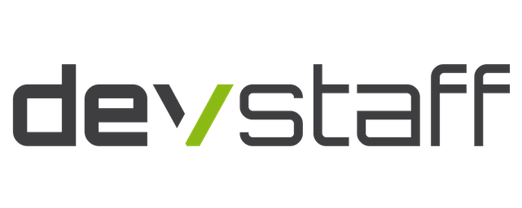

# 

## A Developer Community in Crete

There's a lot of us, devs, here in Crete. Yet, we hardly ever get together in large groups, or even know each other – somewhat strange for our small community, we hope you'll agree. This group is an attempt at bringing us all together for informal chats about what we're all passionate about: technology and software. Join the meetup, learn, teach, speak your mind, sharpen your skills, share the knowledge and help us build a community where devs can openly exchange ideas!

* **Don't know where to start?** Are you new to git and MeetUp? Here is a short intro about the tools we use: [Start Here!](StartHere.md)

* **You just want to join the group?** Great!
  Join our [MeetUp group](http://www.meetup.com/DevStaff-A-Developer-Community-Gathering-In-Crete/) or find us live on: [Slack](https://join.slack.com/t/devstaff/shared_invite/enQtNDYyNTI0NjUyMjczLTBmM2U4YzMxZDc3MmVkMWVkZTRkMmIwZTA0MzI3NDdjNDdkZTFiMTBjODA5OWZiZjhiMGQ2NWZhMzc2ZWNkYjY)

* **Want to contribute?** Check the [Contributing Guidelines](CONTRIBUTING.md)
  and the [Code of Conduct](CodeOfConduct.md) and send a pull request!
* **Curious about what's next?** Check the [topic voting analytics](http://analytics.devstaff.gr)!

## MeetUps :speaker:

The list of all MeetUps held by date:

| #   | Date       | Title & Link |
|-----|------------|--------------|
| #38 | 11/10/2018 | [Remote working: Hints, Tips, Advice, Pitfalls and Open Chat](https://github.com/devstaff-crete/meetup38-RemoteWorking) |
| #37 | 13/09/2018 | [Back to School - Lightning Talks](https://github.com/devstaff-crete/meetup37-LightningTalks) |
| #36 | 12/07/2018 | [Season Finale - Prototyping in VR](https://github.com/devstaff-crete/meetup36-PrototypingInVR) |
| #35 | 14/06/2018 | [IDEs: Super-charging your productivity!](https://github.com/devstaff-crete/meetup35-IDEs) |
| #34 | 10/05/2018 | [GDPR](https://github.com/devstaff-crete/meetup34-GDPR) |
| #33 | 12/04/2018 | [Machine Learning](https://github.com/devstaff-crete/meetup33-MachineLearning) |
| #32 | 08/03/2018 | [From Coder to Manager](https://github.com/devstaff-crete/meetup32-FromCoderToManager) | 
| #31 | 15/02/2018 | [Functional Programming](https://github.com/devstaff-crete/meetup31-FunctionalProgramming) |
| #30 | 11/01/2018 | [Javascript - Node.js / React / Angular](https://github.com/devstaff-crete/meetup30-Javascript) |
| #29 | 14/12/2017 | [Continuous Integration / Unit Testing](https://github.com/devstaff-crete/meetup29-CI) |
| #28 | 09/11/2017 | [Microservices](https://github.com/devstaff-crete/meetup28-Microservices) |
| #27 | 12/10/2017 | [Lightning Talks](https://github.com/devstaff-crete/meetup27-LightningTalks) |
| #26 | 14/09/2017 | [Bitcoin, Blockchain and the future](https://github.com/devstaff-crete/meetup26-BitcoinBlockchainETC) | 
| #25 | 28/08/2017 | [2nd Birthday BBQ](https://www.meetup.com/DevStaff-A-Developer-Community-Gathering-In-Crete/events/242708129/) |
| #24 | 06/07/2017 | [Contributing & Maintaining Open Source Software](https://github.com/devstaff-crete/meetup24-CMOSS) |
| #23 | 08/06/2017 | [Types of Hosting](https://github.com/devstaff-crete/meetup23-TypesOfHosting) |
| #22 | 11/05/2017 | [Agile Software Development](https://github.com/devstaff-crete/meetup22-AgileSoftwareDevelopment) |
| #21 | 06/04/2017 | [Remote Working](https://github.com/devstaff-crete/meetup21-RemoteWorking) |
| #20 | 09/03/2017 | [Tor](https://github.com/devstaff-crete/meetup20-TOR) |
| #19 | 09/02/2017 | [CMS](https://github.com/devstaff-crete/meetup19-CMS) |
| #18 | 12/01/2017 | [Lightning Talks](https://github.com/devstaff-crete/meetup18-lightningTalks) |
| #17 | 08/12/2016 | [Working at (extremely) large scale](https://github.com/devstaff-crete/meetup17-largescale) |
| #16 | 10/11/2016 | [React.js - The hottest JS lib for building UIs](https://github.com/devstaff-crete/meetup16-ReactJs) |
| #15 | 13/10/2016 | [sass - Syntactically Awesome Style Sheets](https://github.com/devstaff-crete/meetup14-Sass) |
| #14 | 08/09/2016 | [Lightning talks](https://github.com/devstaff-crete/meetup13-LightningTalks-SoftwareballGame) |
| #13 | 14/07/2016 | [Password Management](https://github.com/devstaff-crete/meetup12-infosec) |
| #12 | 09/06/2016 | [NoSQL](https://github.com/devstaff-crete/meetup11-NoSQL) |
| #11 | 27/05/2016 | Secrets of Concurrency |
| #10 | 12/05/2016 | [Design Patterns](https://github.com/devstaff-crete/meetup10-DesignPatterns) |
| #09 | 14/04/2016 | [IoT - Internet of Things](https://github.com/devstaff-crete/meetup09-IoT) |
| #08 | 10/03/2016 | [Start-Ups, Spin-offs](https://github.com/devstaff-crete/meetup08-Startups) |
| #07 | 11/02/2016 | [Developing with security in mind](https://github.com/devstaff-crete/meetup07-Security) |
| #06 | 14/01/2016 | [Mobile Devevelopment](https://github.com/devstaff-crete/meetup06-MobileDev) |
| #05 | 10/12/2015 | [Unit Testing](https://github.com/devstaff-crete/meetup05-Testing) |
| #04 | 12/11/2015 | [Design for Developers](https://github.com/devstaff-crete/meetup04-Design) |
| #03 | 08/10/2015 | [DevOps: from concept to movement to implementation](https://github.com/devstaff-crete/meetup03-DevOps) |
| #02 | 10/09/2015 | [Node.js: Building a Restful API](https://github.com/devstaff-crete/meetup02-NodeJS) |
| #01 | 09/07/2015 | [The Git Version Control System](https://github.com/devstaff-crete/meetup01-Git) |

Subscribe to [our calendar](http://www.meetup.com/DevStaff-A-Developer-Community-Gathering-In-Crete/events/) and stay informed.

## Hack Sessions :video_game:

You can [organize your own hack session](HackSessionHowTo.md) anytime.

The list of all Hack Sessions held by date:

| Date | Title & Link |
|------|--------------|
| 17/10/2018 | [How to develop a Distributed App on Ethereum](https://www.meetup.com/devstaff/events/255475024/) |
| 03/07/2018 | [Kubernetes for Application Developers](https://www.meetup.com/devstaff/events/252306246/) |
| 07/06/2018 | [Docker Level 2](https://www.meetup.com/devstaff/events/251228890/) |
| 31/05/2018 | [Docker Level 1](https://www.meetup.com/devstaff/events/251190634/) |
| 19/01/2018 | [Git: Beyond the Basics](https://www.meetup.com/devstaff/events/246863163/) |
| 19/09/2017 | [Ansible Hack Session #1](https://www.meetup.com/devstaff/events/243440678/) |
| 01/12/2016 | [Django Hack Session](https://www.meetup.com/devstaff/events/235617760/) |
| 01/09/2016 | [Hashicorp Vault, AWS KMS, Chef/Ansible Vault, Consul](http://www.meetup.com/DevStaff-A-Developer-Community-Gathering-In-Crete/events/233637796/) |
| 12/01/2016 | [Tor Hack Session](https://github.com/DaKnOb/TorConfig) |
| 01/12/2015 | [Docker Hack Session](https://github.com/devstaff-crete/docker-hack-sessions) |

More hack sessions have been organized, but they are missing from this list. If you know any, please help adding them by submitting a Pull Request.

## Projects :construction:

Find [Open Source Software](projects/README.md) and Projects currently developed by DevStaff Members. You can add your own by sending us a pull request.

## Job Postings :postal_horn:

Check the [job openings](jobs/README.md), posted by DevStaff members. You can add your own by
sending us a pull request.

## Org Meetups

An org meetup is a simple get-together, **open to every member of our community** who would like to contribute / discuss some organizational issues, future topics etc. Also a good opportunity to chat about all-things-tech :)

DevStaff is an open community. Open, as in Open Source. If you don't like anything about the community you can change it! 

_Hint: Decisions are made in Org Meetups ;)_

## Shared Documents :book:

The [documents section](https://github.com/devstaff-crete/DevStaff-Heraklion/tree/master/documents) contains a list of general purpose documents (e.g. legal, business, presentations, etc.) that DevStaff members have freely shared to be used by others in the community. Sharing is caring, so please open a PR with any documents you might have that you feel other DevStaff members could use!

## Chat Rooms :speech_balloon:

The community uses a few different chatrooms based on [Slack](https://join.slack.com/t/devstaff/shared_invite/enQtNDYyNTI0NjUyMjczLTBmM2U4YzMxZDc3MmVkMWVkZTRkMmIwZTA0MzI3NDdjNDdkZTFiMTBjODA5OWZiZjhiMGQ2NWZhMzc2ZWNkYjY) for our online daily chat. You can find there the latest tech news, interesting articles, random pieces of information and a lot of heated discussions! Drop an email to [info@devstaff.gr](mailto:info@devstaff.gr?subject:Slack Invite), so we can send you an invite, or just click [here](https://join.slack.com/t/devstaff/shared_invite/enQtNDYyNTI0NjUyMjczLTBmM2U4YzMxZDc3MmVkMWVkZTRkMmIwZTA0MzI3NDdjNDdkZTFiMTBjODA5OWZiZjhiMGQ2NWZhMzc2ZWNkYjY).

* [The Official DevStaff-Heraklion chatroom](https://devstaff.slack.com/messages/general/)
* [Το Καφενείο](https://devstaff.slack.com/messages/random/)

## Meetups Presence Statistics :hand:

You can find [Presence Statistics](/statistics/README.md) for some of the latest ΜeetUps.
